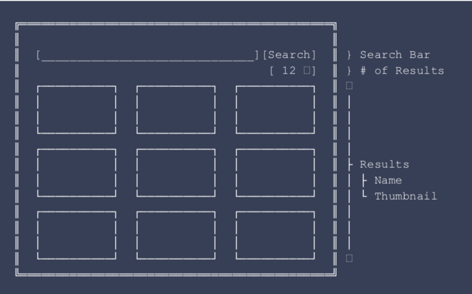
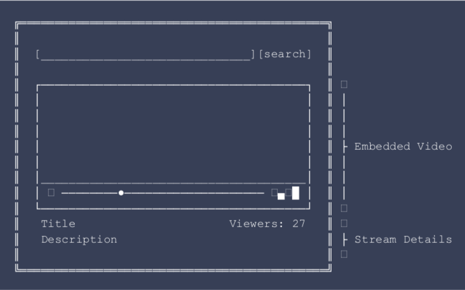

# Twitch Exercise
Blip's React Native interview exercise 

# Requirements

Write a React Native application to search for Twitch streams. The application should also allow the user to select any of the results and start watching the respective stream.
Please write instructions on how to run the app.

## Functional Requirements

* The user can search for Twitch streams.
* Allow the user to choose the number of results when performing a search.
* Implement a mechanism to refresh the result of a search.
* Allow the user to open a stream from the search results.
* When watching a stream keep the the viewers count updated.

### Extras

* Application 
    * Usage feedback (e.g. loading state, error handling).
    * Performance aware (e.g. don't overload the Twitch service or the React Native Bridge).
    * Incremental Search.
    * Responsive UI.

* Development
    * Clean Code.
    * Do not send unused files.
    * Tests.
    * Amaze us :) 

# Mockups

One of the possible approaches is to create an application with two screens: one for searching and one for watching streams.
Note that you don't really need to follow this mockups as they are just an example. Just use your imagination to create a pleasant user experience.

## Home Screen



## View Stream Screen



# About Twitch

The documentation for the Twitch API can be found [here](https://dev.twitch.tv/docs). 

# Run application (emulator)

Follow these steps to run the application:
1. Open a terminal and clone the repository of code and than go to root folder of the project.
```
git clone https://github.com/reactnativeblipinterviews/twitch-victor-vieira.git
cd twitch-victor-vieira
```
2. In the root folder of the project, install the libraries and modules with the command:
```
npm i
```

## iOS
- To run the application in a iOS device (emulator), for the first time it is necessary run the command below:
```
cd ios && pod install && cd ..
```
- After download the pods, now just execute the command to open the emulator and install the app:
```
npm run ios
```


## Android
- To run the application in a Android device (emulator) execute the command:
```
npm run android
```


